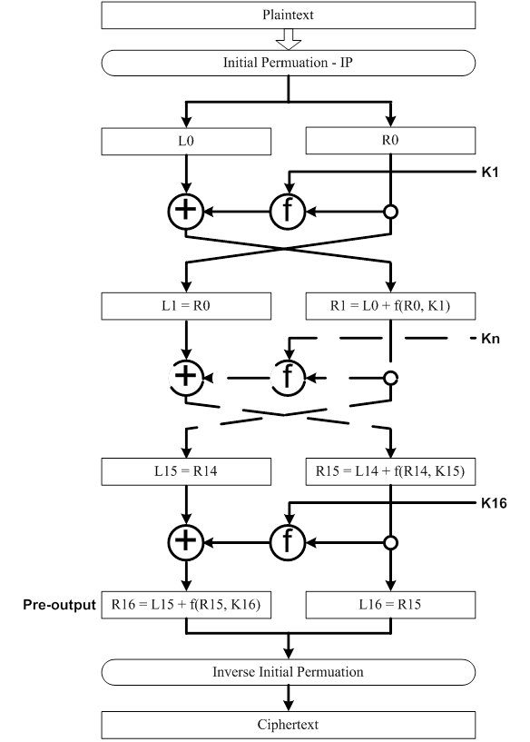

# DES - 3DES
Encryption and decryption
## Data encryption standard (DES)
1. Encrytion
Input: 128 bits plain_text and 128 bits key
Output: 128 bits cipher_text
[Algorithm details](https://vi.wikipedia.org/wiki/DES_(m%C3%A3_h%C3%B3a))
Block diagram - encryption

2. Decryption
The same as encrytion
Input: 128 bits cipher_text and 128 bits key
Output: 128 bits plain_text
.png)
## 3DES
Before using 3TDES, user first generate and distribute a 3TDES key K, which consists of three different DES keys K1, K2 and K3. This means that the actual 3TDES key has length 3×56 = 168 bits. The encryption scheme is illustrated as follows

## Using
Runcode: des.py
In this file: change plain_text and key which you want to encryption (plain_text: text and key: hexa)